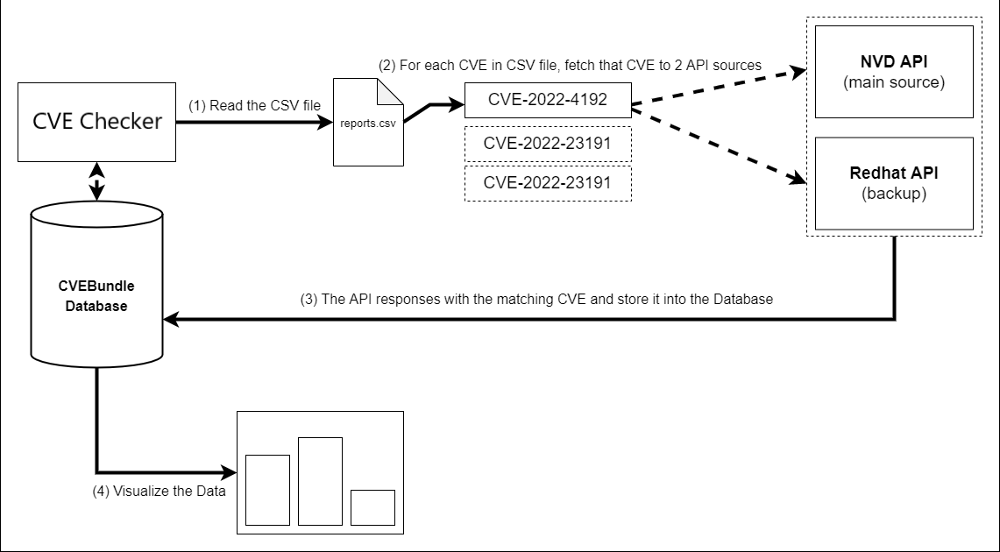
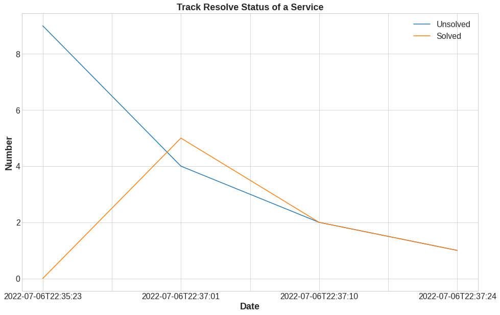
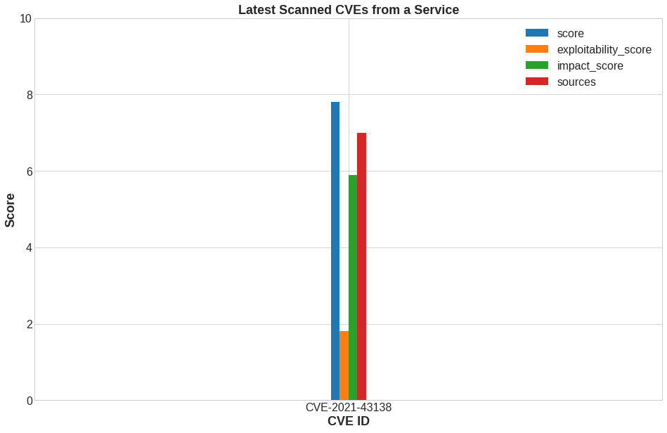

# CVE Trend Checker quick start / README

The CVE Trend Checker is a free, open source tool that me and my friend [Chau Kim Loc](https://www.topcv.vn/xem-cv/DgZRUggFDAFWAFYCVFBVBwIFBVZRUAdaDlZSUw8eb1?fbclid=IwAR2vcrbxA9I3EwIH1JHwf8vyyrPB5GAxRehSO-T4N8lEo9OtjwKhxTa94z0) did when we were doing Graduate Dissertation.
CVE Trend Checker takes CVE report from [Dependency Check](https://jeremylong.github.io/DependencyCheck/) (A Jenkins plugin scanning project vulnerabilities) and fetches to the [National Vulnerability Database](https://nvd.nist.gov/) (NVD) list of [Common Vulnerabilities and Exposures](https://en.wikipedia.org/wiki/Common_Vulnerabilities_and_Exposures#:~:text=Common%20Vulnerabilities%20and%20Exposures%20(CVE)%20is%20a%20dictionary%20of%20common,publicly%20known%20information%20security%20vulnerabilities.) (CVEs) for the CVE information, this tool also crawl from [Twitter](https://twitter.com/?lang=en) to find the top most mentioning CVEs and analyzes, merges and also visualize the data for better understanding.


*The work flow of CVE Trend Checker*

## Development

The CVE Trend Checker is still in development, these are some features that we're planning to build:
- [ ] Export a HTML/PDF file to report the problems and for better reviewing.
- [ ] Integrate with Twitter/Darkweb Crawler.
- [ ] Merge them together for better analytics.
- [ ] Build a Web Application with [Django](https://www.djangoproject.com/) to visualize the images.
- [x] Finish the base source code for CVE Trend Checker.
- [x] Track the status of the current project.
- [x] Print out the current latest CVEs of the project.
- [x] Build a system for find the keywords that match with each CVEs.

## Requirements

Before using the CVE Trend Checker, make sure you have these dependencies:
> :warning: **The CVE Trend Checker was built to only compatible with Linux system**
- Install [Python3](https://realpython.com/installing-python/#how-to-build-python-from-source-code) in Linux system.
- Install [Pip3](https://bootstrap.pypa.io/get-pip.py).

Activate the Python3 Virtual Environment:
```bash
$ python3 -m venv cve-trend-checker
$ cd cve-trend-checker
$ source bin/activate.fish # depends on your shell.
```

Clone this project and install required modules:
```bash
$ git clone https://github.com/shelldog/cve-trend-checker
$ python3 -m pip install -r requirements.txt
```

## Usage

As described in the [Workflow Chart](./images/flow.png), the CVE Trend Checker first will take the given report file and start scanning it (that report file comes from after the [Dependency Check](https://jeremylong.github.io/DependencyCheck/) has already scanned the project and export a report file). Luckily, I pushed a sample report file on the `example` folder.
```bash
# 2 parameters were given:
# -f: takes a report file
# -n: takes a project's name
$ python3 cve_trend_checker/cli.py -f ./cve_trend_checker/example/sample.csv -n project
```

## Plotting

There are currently 2 options to plot an image: `track` and `latest`
- `Track` will plot and report the current status like how much CVEs was solved or CVEs still exists.
- `Latest` simply just plots the latest CVEs that still not be solved.

### Track


*Plot image of tracking the project's status*

Use this command to plot the image:
```bash
# 3 parameters were given:
# -p: tells the system that we want to plot
# -n: specifies the name
# -t: tells the system to track
$ python3 cve_trend_checker/cli.py -p -n project -t
```

### Latest


*Plot image of latest CVEs*

Use this command to plot the image:
```bash
# 3 parameters were given:
# -p: tells the system that we want to plot
# -n: specifies the name
# -l: tells the system to plot the latest
$ python3 cve_trend_checker/cli.py -p -n project -l
```
